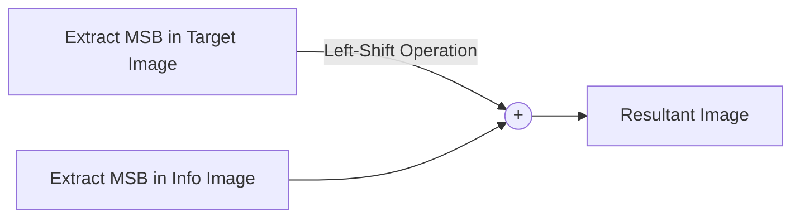
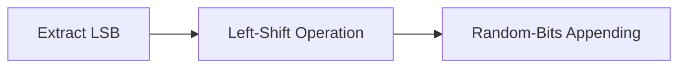

# Self-Correction in Image Steganography Project Report

This repo is intended for project of course Digital Image Processing at SUSTech, in 2021 Spring Semester. This project is focused on steganography in digital images.

[toc]

## Background

### Steganography

### Self-Correction

## Methodology

### Hamming Encoding and Decoding of Digital

---

## Implementation

### Image Steganography

In our work, we use LSB algorithm to implement digital image steganography.

#### Extracting the Bits

The basic functions for obtaining the most significant bits and the least significant bits are required. Therefore, we defined `utils.msb()` and `utils.lsb()`.

The most intuitive way for conducting such operation is first converting the intensity value to binary string expression, then do string cropping and concatenating.

- Function `bin()` converts a number into form of `0bxxxx`, therefore, the prefix `0b` should be removed.
- In which, `xxxx` is the binary expression of the number, and may not be exactly `8` digits for `uint8` type, therefore, zero-padding may be needed.

The code based on such method is shown below.

```python
def msb(array: np.ndarray, bits: int = 4) -> np.ndarray:
    row, col, ch = array.shape
    return np.array([
        bin(array[i, j, k])[2:].zfill(8)[:bits]
        for i in range(row)
        for j in range(col)
        for k in range(ch)]).reshape(row, col, ch)


def lsb(array: np.ndarray, bits: int = 4) -> np.ndarray:
    row, col, ch = array.shape
    return np.array([
        bin(array[i, j, k])[2:].zfill(8)[8 - bits:]
        for i in range(row)
        for j in range(col)
        for k in range(ch)]).reshape(row, col, ch)
```

However, `Python` provides a variety of flexible bit operation, and `NumPy` offers `frompyfunc()` function to conduct an operation over the total array, and also supports the broadcasting of bit operators. In such case, we may directly utilizing bit shifting operators.

For obtaining the most significant bits, simply do bit right shift.

```python
def msb(array: np.ndarray, bits: int = 4) -> np.ndarray:
    """
    Extract the most significant bits from the array
    :param array:
    :param bits: number of msb
    :return: The most significant bits stored in numpy.ndarray, in int datatype
    """
    return np.frompyfunc(lambda x: x >> bits, 1, 1)(array).astype(np.uint8)
```

For obtaining the least significant bits, we may first obtain its most significant bits, then left shift and subtract it from the array.

```python
def lsb(array: np.ndarray, bits: int = 4) -> np.ndarray:
    """
    Remove the least significant bits from the array
    :param array:
    :param bits: number of lsb
    :return: The least significant bits stored in numpy.ndarray, in int datatype
    """
    return array - np.frompyfunc(lambda x: x << bits, 1, 1)(msb(array, bits)).astype(np.uint8)
```

The performance is greatly improved, and the code is extraordinarily simplified.

>Note that, the returned `ufunc` always returns `PyObject` arrays, so datatype casting to `numpy.uint8` is required otherwise `Pillow` will not be able to save the array as file.

#### Resizing the Images

In our implementation, the information image encoded into the target image must have compatible dimensions. If not so, image resize is automatically taken.

```python
def resize(info: np.ndarray, size=None, target: np.ndarray = None, interp=Image.BILINEAR) -> np.ndarray:
    """
    Resize the info image into the size specified. The image is firstly converted into Pillow.Image mode, then the
    builtin resize function is invoked.
    Be REALLY CAREFUL about the different convention of dimension in Pillow and NumPy

    :param info: The image to be resized.
    :param size: The size specified, in form of NumPy style (height, width), the priority of which is higher than target
    :param target: The target image.
    :param interp: The interpolation method, BILINEAR by default
    :return: The resized info image, in numpy.ndarray mode.
    """

    if size is None:
        size = target.shape[:2][::-1]
    else:
        size = size[::-1]

    return np.array(Image.fromarray(info).resize(size, interp))
```

Be careful that, the dimension conventions in `NumPy` and `Pillow` are different. `NumPy` uses array-like row major convention, instead in `Pillow` image-like width-height-channel is adapted.

---

#### Image Encryption

With the functions predefined, and the broadcasting feature of bit operators in `NumPy` we may easily implement the image encryption. The function is defined as `write.imgwrite()`.

```python
def imgwrite(info: np.ndarray = sherlock, target: np.ndarray = sevilla, bits: int = 4,
             interp=Image.BILINEAR) -> Union[bool, np.ndarray]:
    """
    Encrypt info into an image. If the dimension of the image to be encrypted and the target is not compatible,
    the info image is automatically stretched.

    :param info: The image to be encrypted, sherlock.jpg by default
    :param target: The image into which the info is encrypted, sevilla.jpg by default
    :param bits: The number of least significant bits chosen, 4 by default
    :param interp: The interpolation method, would be used when automatically resize takes place, BILINEAR by default
    :return: The image with encrypted information, in numpy.ndarray mode, False if encryption failed
    """

    if not isinstance(info, np.ndarray) or not isinstance(target, np.ndarray):
        warn('Incompatible data mode, numpy.ndarray is required.')
        return False

    _info = np.array(info)
    if info.shape != target.shape:
        warn('Incompatible dimension, image is automatically reshaped to the size of the target.')
        _info = resize(info, target=target, interp=interp)

    return (msb(target, bits) << bits) + msb(_info, bits)
```

In this function, when the dimension is not compatible, resize is automatically introduced, and user warning is thrown in such case.



#### Image Decryption

Similar to decryption, the key function is realized within one line of code in `read.imgread()`.

```python
def imgread(img: np.ndarray, bits: int = 4, random: bool = True) -> Union[bool, np.ndarray]:
    """
    Read encrypted image.

    :param img: The image carrying the encrypted image.
    :param bits: The number of least significant bits used fro steganography.
    :param random: Fill the least significant bits of the decrypted image with random values, disabled by default
    :return: The decrypted image.
    """

    if not isinstance(img, np.ndarray):
        warn('Incompatible data mode, numpy.ndarray is required.')
        return False

    return (lsb(img, bits) << bits) + (np.random.randint(0, 15, size=img.size).reshape(img.shape) if random else 0)
```

Note that, random bits are appended to the LSB of the decrypted image, since the least significant bits are likely to behave randomly in nature.



### Hamming Encoding and Decoding

To start with, several features of the Hamming code is predefined.

- The size of the hamming block must be $2^n$ by $2^n$, in which $n$ is an integer greater than $1$.
- With zero indexing, the parity bits are those bits whose indexes are the interger power of $2$, for example, `1`, `2`, `4`, etc.
- The `0`-th bit in the Hamming block is also an parity bit, which is responsible for the global parity check.
- The parity bits are adjusted to satisfy that the number of `1` bits in each parity group is even.


This figure presents a common 4 by 4 hamming block, its `0`, `1`, `2`, `4` and `8`-th bits are the parity redundant bits. The parity groups distribution is shown in the table below, in row-major, `0`-index order.

| Parity Bit | The Binary Index | Parity Group                   |
| :--------: | :--------------: | ------------------------------ |
|    `0`     |      `0000`      | The whole data block           |
|    `1`     |      `0001`      | The `1`st and the `3`rd column |
|    `2`     |      `0010`      | The `2`st and the `3`rd column |
|    `4`     |      `0100`      | The `1`st and the `3`rd row    |
|    `8`     |      `1000`      | The `2`st and the `3`rd row    |

The parity bits (`0`-th) excluded have special binary address, which has only one `1` bit, and the addressed of the data bits in their corresponding parity group all having `1` bit in that particular position. In such way, the Hamming block can be extended to larger size, and the parity group can be found and evaluated by simple justifications.

It can also be easily proved that, with such number of parity bits, we can determine with certitude the location of a single bit-flip.

#### Encode One Data Block

The function `hamming.encode_block()` converts a series of data bits into single data block with Hamming redundant bits added, if the data bits provided does not correspond with a possible size of a $2^n$ by $2^n$ data block, the function returns `False` and gives warning.

First, define the function.

```python
def encode_block(data: np.ndarray) -> Union[np.ndarray, bool]:
    """
    Calculate the hamming redundant bits and encode which with the original data into a data block.

    :param data: The data bits in one block, the data mode of the array must be bool or 1s and 0s.
    :return The complete data block with data bits and hamming redundant bits encoded
    """
```

Basically, for an $2^n$ by $2^n$, $n\in N$ data block, the hamming redundant bits in which should be

$$
R = 2n + 1.
$$

In which, $n$ for row, $n$ for column and an extra bit at $(0, 0)$ position for global check. Accordingly, the number of data bits is

$$
D = \left(2^n\right)^2 - R = 2^{2n} - 2n - 1.
$$

Specifically, for $n=0$, obtains $D_0=0$ and $R_0=1$, namely no actual data can be stored. For $n=1$, $D_1=1$ and $R_1=3$, namely in a $2$ by $2$ data block, $3$ redundant bits are required and only $1$ data bit can be stored.

Therefore, we may check the size of the input data array.

```python
n = 0
while 1 << 2 * n - n << 1 - 1 < data.size:
    n += 1

if 1 << 2 * n - n << 1 - 1 != data.size:
    warn('Wrong number of data bits')
    return False
```

In row-major and 0-index notation, the positions of each parity bits in the data block in flattened pattern are

$$
\begin{cases}
    (0, 0) = 0\\
    (0, 2^i) = 2^i\\
    (2^i, 0) = 2^i \times 2^n = 2^{i + n}
\end{cases}\quad i \in \{0, 1, \dots, n - 1\}
$$

In other words, the common feature of the redundant bits is that, the binary indexes of which has only one or no zero digit. In a $2^n$ by $2^n$ data block, the indexes ranges from $0$ to $2^{2n}-1$, which can be specified with $2n$ digits of binary number. Hence, we may first insert the parity bits as $0$ to form the data block.

```python
parity = [1 << i for i in range(1 << n)]
block = [0]
i = 0
for j in range(2 << 2 * n):
    if j in parity:
        block += [0]
    else:
        block += data[i]
        i += 1
```

The parity group of each parity bit is specified by the `1` digit at certain position of its index. The most convenient way of conducting such judgment to determine whether one data bit in the block is in the parity or not is by bitwise AND operation.

Take the parity bit at index `2` in a `4` by `4` block for example, the binary index of the parity bit is `0010`, which has the single `1` at the `1` position. Therefore, to justify whether data bit at index `5` is in its parity group or not, first obtain is binary index `0101`. Then, we need to determine the digit at `1` position, and such comparison can be easily done by simply doing bitwise AND operation between `0010` and `0101`. The key point of such feasibility is listed below.

- The index of the parity bit is specifically chosen, so that it has only one `1` digit in its binary index.
- The indexes of the parity group is specifically chosen, so that the binary indexes of which all have `1` digit in the corresponding position.
- `0 and 1 = 0`, `0 and 0 = 0`, `1 and 0 = 0`, `1 and 1 = 1`

Therefore, when the data bit is not in the parity bit, the result of bitwise `AND` operation is zero.

It is already known that, the goal of calculating the parity bit is to make the number of `1` bits in the parity group even. Another useful fact is that, the `XOR` has the following features.

| Number |    Value    | `XOR` Result |
| :----: | :---------: | :----------: |
|  Even  |     `1`     |     `0`      |
|  Odd   |     `1`     |     `1`      |
|  Even  |     `0`     |     `0`      |
|  Odd   |     `0`     |     `0`      |
|   \    | `1` and `0` |     `1`      |

With such characteristics, we may easily find the position of the parity bits, the corresponding parity groups, and adjust the parity bits with an `XOR` operation.

```python
for p in range(n << 1):
    block[1 << p] = reduce(lambda x, y: x ^ y, [bit for i, bit in enumerate(block)if 1 << p & i])
block[0] = reduce(lambda x, y: x ^ y, block[1:])

return np.array(block).reshape(1 << n, 1 << n)
```

#### Encode Several Data Blocks

#### Decode One Data Block

#### Decode Several Data Blocks

---

### Combining Self-Correction and Image Steganography

```python
for i in range(1, 4):
    for j, bit in enumerate(np.nditer(_target, order='F', op_flags, ['readwrite'])):
        bit += np.uint8(0)
        np.take(blocks, range(i << 2, i + 1 << 2), mode='wrap') << 3 - i
```

---

## How to Use This Package

## Useful Coding Details

### In
