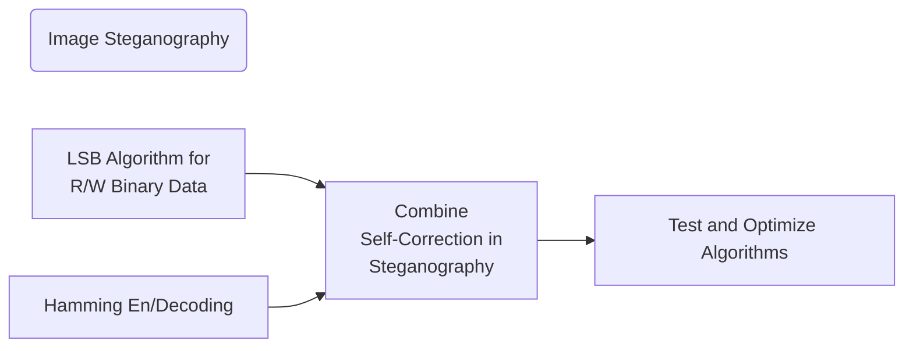
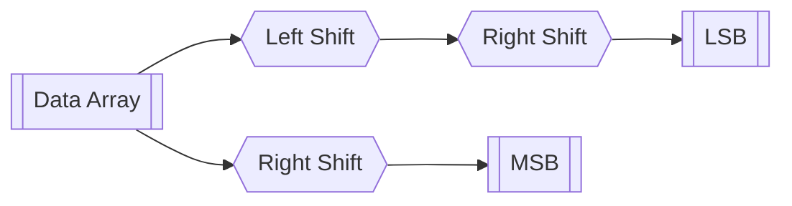
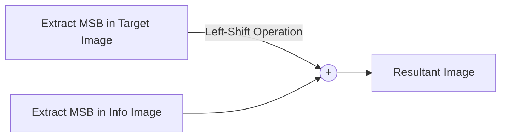
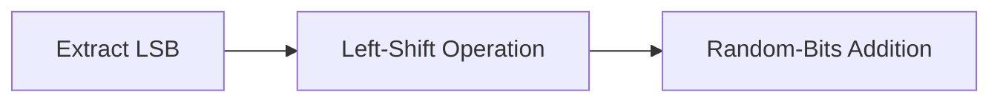
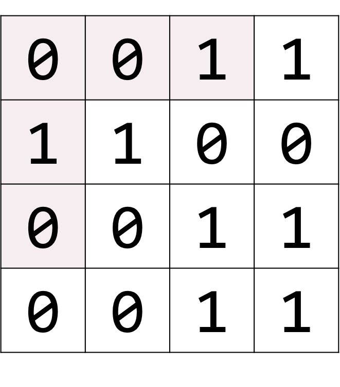
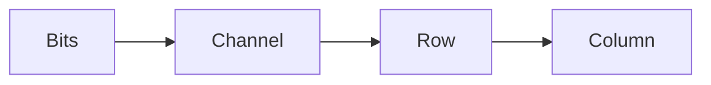
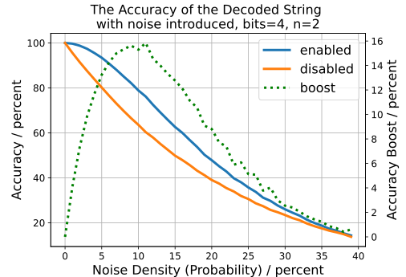

# Self-Correction in Image Steganography

This repo is intended for project of course Digital Image Processing at SUSTech, in 2021 Spring Semester. This project is focused on steganography in digital images. This repo is contributed by

- HUANG Guanchao, SID 11912309, from SME
- LI Wenjie, SID 11912721, from SME

The complete resources can be retrieved at [our GitHub repo](https://github.com/kommunium/dip-project-stegano).


[toc]

## Background

### Steganography

>*Steganography* is the practice of concealing a message within another message or a physical object. In computing/electronic contexts, a computer file, message, image, or video is concealed within another file, message, image, or video.
>
>The advantage of steganography over cryptography alone is that the intended secret message does not attract attention to itself as an object of scrutiny. Plainly visible encrypted messages, no matter how unbreakable they are, arouse interest and may in themselves be incriminating in countries in which encryption is illegal.[^stegano]

[^stegano]: [Wikipedia: Steganography](https://en.wikipedia.org/wiki/Steganography)

The existing communication security is mainly divided into encryption and information hiding: encryption mainly operates on the secret information itself, but the plaintext after special processing is more likely to be suspected by the third party; Information hiding hides the existence of the secret data, which makes the secret data communicate covertly without the suspicion of the third party.

Because every web site relies on multimedia, such as audio, video, and images. Steganography can embed secret information into digital media without damaging the quality of its carrier. The third party is neither aware of the existence of secret information nor aware of the existence of secret information. Therefore, key, digital signature and private information can be transmitted safely in an open environment (such as Internet or intranet).

Steganalysis models can be divided into special steganalysis model and general steganalysis model. Because the special steganalysis model only aims at specific steganalysis algorithms and has poor detection effect for mismatched or unknown steganalysis algorithms, with the emergence of various kinds of adaptive steganalysis algorithms, the special steganalysis model is unable to do well and gradually withdraws from the historical stage, Universal steganalysis model has gradually become the mainstream steganalysis model.

On the whole, steganography can be divided into three parts: encoder, decoder and discriminator. The encoder is responsible for embedding the hidden image into the original image, and the decoder is responsible for extracting the hidden image from the steganographic image. At the same time, the encoder and decoder should work together to ensure that the steganographic image is consistent with the original image as much as possible, Only in this way can the discriminator be cheated until the encoder can generate the steganographic image which is false but not true. That's how steganography works.

As an early steganography method, LSB (least significant bit) is a steganography method based on the least significant bit of the image to modify and store information. Using the insensitivity of human eyes to color differences, the secret information is embedded into the least significant bit of the image through certain embedding methods, so that the information we need to hide is put into the least significant bit of the image through certain methods. LSB for the least significant bit is the replacement operation, the image format with LSB algorithm needs to be bitmap form, that is, the image can not be compressed, so LSB algorithm is mostly used in PNG, BMP and other spatial images.

In this project, we will use LSB algorithm to achieve image steganography, a picture or a piece of text steganography in a carrier image. LSB is a typical non adaptive steganography algorithm. The idea of non adaptive steganography is that the less the pixel content in the carrier image is modified, the stronger the anti steganalysis ability of steganography algorithm is. Therefore, non adaptive steganography is usually combined with error correction coding (steganography code) to realize the specific embedding process.

### Self-Correction

*Self-correction*, or particularly self-correction code is widely used in computer technology. In data transfer and storage, data is possible to be corrupted with either bit-flip or other physical forms of damage, such as dimmed or covered. Some specific ways of encoding an decoding data allows us to discover and even correct such data error, with a small cost of space and performance.

>In computer science and telecommunication, *Hamming codes* are a family of linear error-correcting codes. Hamming codes can detect up to two-bit errors or correct one-bit errors without detection of uncorrected errors. By contrast, the simple parity code cannot correct errors, and can detect only an odd number of bits in error. Hamming codes are perfect codes, that is, they achieve the highest possible rate for codes with their block length and minimum distance of three. Richard W. Hamming invented Hamming codes in 1950 as a way of automatically correcting errors introduced by punched card readers. In his original paper, Hamming elaborated his general idea, but specifically focused on the Hamming (7, 4) code which adds three parity bits to four bits of data.[^hamming]

[^hamming]: [Wikipedia: Hamming Code](https://en.wikipedia.org/wiki/Hamming_code)

When a computer stores or moves data, data bit errors may occur. As a common self correcting coding technology, Hamming code is widely used in memory (RAM) to detect and correct single bit errors by inserting a verification code into the transmitted message stream.

The main feature of Hamming code lies in its special parity bit setting. The parity bit is set at the position of $2^n$, and each parity bit is responsible for the parity check of a specific block, so that there are even `1` in the corresponding block. Through multiple parity checks, the location of the error can be determined, which is convenient to expand the scale and the proportion of redundant space is small.

In this project, we will use Hamming code to realize the self correction of binary code, and combine this self correction technology with image steganography to enhance the robustness of image steganography, so that the steganographic information in the image has a certain ability to resist noise interference. Finally, we introduce noise to test the accuracy of binary coding after the steganographic information passes through AWGN channel.

## Methodology

Inspired by LSB algorithm, we may convert string into binary data series, than encode which into image.



---

## Implementation

This section shows the detailed explanation of core codes on how our algorithm is implemented.

### Image Steganography

In our work, we use LSB algorithm to implement digital image steganography.

#### Extracting the Bits

The basic functions for obtaining the most significant bits and the least significant bits are required. Therefore, we defined `utils.msb()` and `utils.lsb()`.

The most intuitive way for conducting such operation is first converting the intensity value to binary string expression, then do string cropping and concatenating.

- Function `bin()` converts a number into form of `0bxxxx`, therefore, the prefix `0b` should be removed.
- In which, `xxxx` is the binary expression of the number, and may not be exactly `8` digits for `uint8` type, therefore, zero-padding may be needed.

The code based on such method is shown below.

```python
def msb(array: np.ndarray, bits: int = 4) -> np.ndarray:
    row, col, ch = array.shape
    return np.array([
        bin(array[i, j, k])[2:].zfill(8)[:bits]
        for i in range(row)
        for j in range(col)
        for k in range(ch)]).reshape(row, col, ch)


def lsb(array: np.ndarray, bits: int = 4) -> np.ndarray:
    row, col, ch = array.shape
    return np.array([
        bin(array[i, j, k])[2:].zfill(8)[8 - bits:]
        for i in range(row)
        for j in range(col)
        for k in range(ch)]).reshape(row, col, ch)
```

However, `Python` provides a variety of flexible bit operation, and `NumPy` offers `frompyfunc()` function to conduct an operation over the total array, and also supports the broadcasting of bit operators. In such case, we may directly utilizing bit shifting operators.

For obtaining the most significant bits, simply do bit right shift.

```python
return np.frompyfunc(lambda x: x >> bits, 1, 1)(array).astype(np.uint8)
```

For obtaining the least significant bits, we may first obtain its most significant bits, then left shift and subtract it from the array.

```python
return array - np.frompyfunc(lambda x: x << bits, 1, 1)(msb(array, bits)).astype(np.uint8)
```

>Note that, the returned `ufunc` always returns `PyObject` arrays, so datatype casting to `numpy.uint8` is required otherwise `Pillow` will not be able to save the array as file.

However, the above is still not the most elegant way of implementation. `NumPy` provides builtin support for the broadcasting of bit operators, and the productive code is as follows.

```python
def msb(array: np.ndarray, bits: int = 4) -> np.ndarray:
    """
    Extract the most significant bits from the array

    :param array: The array from which the most significant bits are extracted.
    :param bits: number of msb
    :return: The most significant bits stored in numpy.ndarray, in np.uint8 datatype
    """

    return array >> bits


def lsb(array: np.ndarray, bits: int = 4) -> np.ndarray:
    """
    Extract the least significant bits from the array

    :param array: The array from which the least significant bits are extracted.
    :param bits: Number of the least significant bits to be extracted.
    :return: The least significant bits stored in numpy.ndarray, in np.uint8 datatype
    """

    return msb(array << bits)
```



The performance is greatly improved, and the code is extraordinarily simplified.

#### Resizing the Images

In our implementation, the information image encoded into the target image must have compatible dimensions. If not so, image resize is automatically taken.

```python
def resize(info: np.ndarray, size=None, target: np.ndarray = None, interp=Image.BILINEAR) -> np.ndarray:
    """
    Resize the info image into the size specified. The image is firstly converted into Pillow.Image mode, then the
    builtin resize function is invoked.
    Be REALLY CAREFUL about the different convention of dimension in Pillow and NumPy

    :param info: The image to be resized.
    :param size: The size specified, in form of NumPy style (height, width), the priority of which is higher than target
    :param target: The target image.
    :param interp: The interpolation method, BILINEAR by default
    :return: The resized info image, in numpy.ndarray mode.
    """
```

This function resizes the image to the size of the target image, or the `size` parameter specified.

```python
if size is None:
    size = target.shape[:2][::-1]
else:
    size = size[::-1]
```

The resizing operation is done through the builtin resize function in `PIL.Image`.

```python
return np.array(Image.fromarray(info).resize(size, interp))
```

Be careful that, the dimension conventions in `NumPy` and `Pillow` are different. `NumPy` uses array-like row major convention, instead in `Pillow` image-like width-height-channel is adapted.

---

#### Image Encryption

With the functions predefined, and the broadcasting feature of bit operators in `NumPy` we may easily implement the image encryption. The function is defined as `write.imgwrite()`.

```python
def imgwrite(info: np.ndarray = sherlock, target: np.ndarray = sevilla, bits: int = 4,
             interp=Image.BILINEAR) -> Union[bool, np.ndarray]:
    """
    Encrypt info into an image. If the dimension of the image to be encrypted and the target is not compatible,
    the info image is automatically stretched.

    :param info: The image to be encrypted, sherlock.jpg by default
    :param target: The image into which the info is encrypted, sevilla.jpg by default
    :param bits: The number of least significant bits chosen, 4 by default
    :param interp: The interpolation method, would be used when automatically resize takes place, BILINEAR by default
    :return: The image with encrypted information, in numpy.ndarray mode, False if encryption failed
    """
```

In this function, when the dimension is not compatible, resize is automatically introduced, and user warning is thrown in such case.

```python
if not isinstance(info, np.ndarray) or not isinstance(target, np.ndarray):
    warn('Incompatible data mode, numpy.ndarray is required.')
    return False

_info = np.array(info)
if info.shape != target.shape:
    warn('Incompatible dimension, image is automatically reshaped to the size of the target.')
_info = resize(info, target=target, interp=interp)

return (msb(target, bits) << bits) + msb(_info, bits)
```



#### Image Decryption

Similar to encryption, the key function is realized within one line of code in `read.imgread()`.

```python
def imgread(img: np.ndarray, bits: int = 4, random: bool = True) -> Union[bool, np.ndarray]:
    """
    Read encrypted image.

    :param img: The image carrying the encrypted image.
    :param bits: The number of least significant bits used fro steganography.
    :param random: Fill the least significant bits of the decrypted image with random values, disabled by default
    :return: The decrypted image.
    """

    if not isinstance(img, np.ndarray):
        warn('Incompatible data mode, numpy.ndarray is required.')
        return False

    return (lsb(img, bits) << bits) + (np.random.randint(0, 15, size=img.size).reshape(img.shape) if random else 0)
```

Note that, random bits are appended to the LSB of the decrypted image, since the least significant bits are likely to behave randomly in nature.



### Hamming Encoding and Decoding

To start with, several features of the Hamming code is predefined.

- The size of the hamming block must be $2^n$ by $2^n$, in which $n$ is an integer greater than $1$.
- With zero indexing, the parity bits are those bits whose indexes are the interger power of $2$, for example, `1`, `2`, `4`, etc.
- The `0`-th bit in the Hamming block is also an parity bit, which is responsible for the global parity check.
- The parity bits are adjusted to satisfy that the number of `1` bits in each parity group is even.



This figure presents a common 4 by 4 hamming block, its `0`, `1`, `2`, `4` and `8`-th bits are the parity redundant bits. The parity groups distribution is shown in the table below, in row-major, `0`-index order.

| Parity Bit | The Binary Index | Parity Group                   |
| :--------: | :--------------: | ------------------------------ |
|    `0`     |      `0000`      | The whole data block           |
|    `1`     |      `0001`      | The `1`st and the `3`rd column |
|    `2`     |      `0010`      | The `2`st and the `3`rd column |
|    `4`     |      `0100`      | The `1`st and the `3`rd row    |
|    `8`     |      `1000`      | The `2`st and the `3`rd row    |

The parity bits (`0`-th) excluded have special binary address, which has only one `1` bit, and the addressed of the data bits in their corresponding parity group all having `1` bit in that particular position. In such way, the Hamming block can be extended to larger size, and the parity group can be found and evaluated by simple justifications.

It can also be easily proved that, with such number of parity bits, we can determine with certitude the location of a single bit-flip.

>For comprehensive understanding of what Hamming code is and how it is functioning, we strongly recommend you check the video about Hamming code made by `3Blue1Brown` channel.
>
>- [Hamming codes, h■w to ov■rco■e n■ise.](https://www.bilibili.com/video/BV1WK411N7kz)
>- [Hamming codes part 2, the elegance of it all](https://www.bilibili.com/video/BV1pV411y7E8)

#### Encode One Data Block

The function `hamming.encode_block()` converts a series of data bits into single data block with Hamming redundant bits added, if the data bits provided does not correspond with a possible size of a $2^n$ by $2^n$ data block, the function returns `False` and gives warning.

First, define the function.

```python
def encode_block(data: np.ndarray) -> Union[np.ndarray, bool]:
    """
    Calculate the hamming redundant bits and encode which with the original data into a data block.

    :param data: The data bits in one block, the data mode of the array must be bool or 1s and 0s.
    :return The complete data block with data bits and hamming redundant bits encoded
    """
```

Basically, for an $2^n$ by $2^n$, $n\in N$ data block, the hamming redundant bits in which should be

$$
R = 2n + 1.
$$

In which, $n$ for row, $n$ for column and an extra bit at $(0, 0)$ position for global check. Accordingly, the number of data bits is

$$
D = \left(2^n\right)^2 - R = 2^{2n} - 2n - 1.
$$

Specifically, for $n=0$, obtains $D_0=0$ and $R_0=1$, namely no actual data can be stored. For $n=1$, $D_1=1$ and $R_1=3$, namely in a $2$ by $2$ data block, $3$ redundant bits are required and only $1$ data bit can be stored.

Therefore, we may check the size of the input data array.

```python
n = 0
while 1 << 2 * n - n << 1 - 1 < data.size:
    n += 1

if 1 << 2 * n - n << 1 - 1 != data.size:
    warn('Wrong number of data bits')
    return False
```

In row-major and 0-index notation, the positions of each parity bits in the data block in flattened pattern are

$$
\begin{cases}
    (0, 0) = 0\\
    (0, 2^i) = 2^i\\
    (2^i, 0) = 2^i \times 2^n = 2^{i + n}
\end{cases}\quad i \in \{0, 1, \dots, n - 1\}
$$

In other words, the common feature of the redundant bits is that, the binary indexes of which has only one or no zero digit. In a $2^n$ by $2^n$ data block, the indexes ranges from $0$ to $2^{2n}-1$, which can be specified with $2n$ digits of binary number. Hence, we may first insert the parity bits as $0$ to form the data block.

```python
parity = [1 << i for i in range(1 << n)]
block = [0]
i = 0
for j in range(2 << 2 * n):
    if j in parity:
        block += [0]
    else:
        block += data[i]
        i += 1
```

The parity group of each parity bit is specified by the `1` digit at certain position of its index. The most convenient way of conducting such judgment to determine whether one data bit in the block is in the parity or not is by bitwise AND operation.

Take the parity bit at index `2` in a `4` by `4` block for example, the binary index of the parity bit is `0010`, which has the single `1` at the `1` position. Therefore, to justify whether data bit at index `5` is in its parity group or not, first obtain is binary index `0101`. Then, we need to determine the digit at `1` position, and such comparison can be easily done by simply doing bitwise AND operation between `0010` and `0101`. The key point of such feasibility is listed below.

- The index of the parity bit is specifically chosen, so that it has only one `1` digit in its binary index.
- The indexes of the parity group is specifically chosen, so that the binary indexes of which all have `1` digit in the corresponding position.
- `0 and 1 = 0`, `0 and 0 = 0`, `1 and 0 = 0`, `1 and 1 = 1`

Therefore, when the data bit is not in the parity bit, the result of bitwise `AND` operation is zero.

It is already known that, the goal of calculating the parity bit is to make the number of `1` bits in the parity group even. Another useful fact is that, the `XOR` has the following features.

| Number |    Value    | `XOR` Result |
| :----: | :---------: | :----------: |
|  Even  |     `1`     |     `0`      |
|  Odd   |     `1`     |     `1`      |
|  Even  |     `0`     |     `0`      |
|  Odd   |     `0`     |     `0`      |
|   \    | `1` and `0` |     `1`      |

With such characteristics, we may easily find the position of the parity bits, the corresponding parity groups, and adjust the parity bits with an `XOR` operation.

```python
for p in range(n << 1):
    block[1 << p] = reduce(lambda x, y: x ^ y, [bit for i, bit in enumerate(block)if 1 << p & i])
block[0] = reduce(lambda x, y: x ^ y, block[1:])

return np.array(block).reshape(1 << n, 1 << n)
```

#### Encode Several Data Blocks

The function is defined as `hamming.encode()`.

```python
def encode(data: np.ndarray, n: int = 2) -> np.ndarray:
    """
    Encoding data into several data blocks of size n by n, with hamming redundant bits
    If the size of the data is not enough to fill the last block, zeros are padded

    :param data: the input data series
    :param n: The size of the data block is specified as 2 ** n, or 1 << n
    """
```

To encode binary information into several data blocks, first divide it into specific size of data groups. First, calculate the number of data bits in each block, and flatten the data array for further indexing operation.

```python
_data_bits = data_bits(n)
_data = data.flatten()
```

If the final data block is not exactly filled with the data array, do zero padding.

```python
if data.size % _data_bits:
    warn("Not enough data bits, zero-padding is automatically introduced.")
    _data = np.append(_data, np.zeros(_data_bits - (data.size - 1) % _data_bits - 1)).astype(np.uint8)
```

The following execution is trivial, reshape the data bits array, and invoke `hamming.encode_block()` for data bits in each block.

```python
_data = _data.reshape(-1, _data_bits)
return np.array([encode_block(block) for block in _data])
```

#### Decode One Data Block

Similar to encoding, first define `hamming.decode_block()` for decoding.

```python
def decode_block(block: np.ndarray) -> Union[np.ndarray, bool]:
    """
    Decode a data block with hamming parity bits.

    :param block: The data block to be decoded
    :return the decoded data bits, False if the block is invalid
    """
```

To start with, we need judge whether the data block is valid or not. The proper size needs to be the positive integer power of `4`, and the judgement is done in simple `AND` operation.

```python
if not block.size & block.size - 1 and block.size & 0x5555_5555:
```

To locate the position of a single bit-flip, we only need to do `XOR` operation over all the indexes of `1` bits.

```python
_block = np.array(block.flat)
flip = reduce(lambda x, y: x ^ y, [i for i, bit in enumerate(_block) if bit] + [1, 1])
```

According to the feature of Hamming parity bits narrated in previous sections, the common characteristic for each parity group is the `1` digit on certain position in their binary addresses. The bit-wise `XOR` operation conducted on the indexes functions as parity check for each parity group, and thus, the result is the index for the flipped bit, when not `0`.

>Adding additional `[1, 1]` into the list will not affect the result, since `1 ^ 1 = 0`. This avoids the exception caused by an empty list being `reduce`d when all the bits are `0`.

Then, do global check, if global parity check also fails, then 2 or more bit-flips must have occurred, Hamming code can not self-correct.

```python
if flip:
    if reduce(lambda x, y: x ^ y, _block):
        warn('Two or more bit-flips occur, self-correction failed.')
    warn("Single bit-flip at index {} corrected".format(flip))
    _block[flip] = not _block[flip]
```

After self-correction, return the data bits in the block.

```python
return np.array([bit for i, bit in enumerate(_block) if i and i & i - 1])
```

Outside the initial `if` block, if the data block is not valid, warn user and return `False`.

```python
warn('Invalid block size.')
return False
```

#### Decode Several Data Blocks

Similarly, decoding function can be implemented, as `hamming.decode()`.

```python
def decode(blocks: np.ndarray, n: int = 2) -> np.ndarray:
    """
    Decode the data blocks. Automatic zero-padding takes place when the bits are not enough.

    :param blocks: The blocks series to be decoded.
    :param n: The size of each data block is specified as 2 ** n, or 1 << n
    :return The decoded data
    """

    block_size = 1 << (n << 1)
    if blocks.size % block_size:
        warn("Not enough bits, zero-padding is automatically introduced.")
        _blocks = np.append(blocks.flat, np.zeros(block_size - (blocks.size - 1) % block_size - 1))
    else:
        _blocks = blocks.flatten()
    _blocks = _blocks.reshape(-1, 1 << (n << 1))
    return np.array([decode_block(block) for block in _blocks])
```

---

### Combining Self-Correction and Image Steganography

#### Convert String to Binary Data Array

To encrypt any digital information, for example, in our work, string into the target image, conversion to binary data is needed. Function `utils.str_to_data()` converts a string to binary data series.

```python
def str_to_data(info: str) -> np.ndarray:
    """
    Convert string into binary ASCII data

    :param info: The string to be converted.
    :return: The converted binary ASCII data.
    """

    return np.array([[ord(char) & 1 << 7 - i > 0 for i in range(8)] for char in info], dtype=np.uint8)
```

The builtin function `ord()` returns the ASCII code for character, in `int` type. With bit-wise `AND` operation, we extract the bits at each position.

#### Protective Characters Padding

Note that in `hamming.encode()` function, if the data bits are not enough, zero bits padding is introduced to fill the data blocks. However, as would be discussed in the following sections, the reading process is sequential and continuous, which may incur periodic unrecognizable characters exception in decryption. In more concise language, padded zero bits are also considered as part of data bits, and thus fails.

To avoid such errors, protective characters are padded to ensure that the size of the binary data array is exactly multiples of number of data bits in Hamming block.

```python
def str_pad(info: str, n: int = 2) -> str:
    """
    Pad a string with protective [NUL] character \x00 to avoid wraparound errors in steganography when hamming encoding is enabled.

    :param info: The string to be padded
    :param n: The size of the hamming block is specified by 2 ** n, or n << 1
    :return: The padded string.
    """

    return info + '\x00' * (data_bits(n) - (len(info) - 1) % data_bits(n) - 1)
```

In which, `utils.data_bits()` function calculates the number of data bits in a specific size of Hamming data block.

```python
def data_bits(n: int = 2):
    """
    Calculate the data bits in one hamming data block.

    :param n: The dimension of the hamming data block is specified by 2 ** n or n << 1
    :return: The number of valid data bits carrying information in one hamming data block.
    """

    return (1 << 2 * n) - (n << 1) - 1
```

#### Writing Binary Data Array to Image

The function is defined as `write.strwrite()`.

```python
def strwrite(info: str, target=lena, bits: int = 4, hamming=False, n: int = 2) -> np.ndarray:
    """
    Encrypt string into an image. In the outermost loop, write the data into the highest bit, then the second highest bit, all the way down to the 0th it. The pixels are flattened in Fortran style, therefore the information is firstly write along each channel, then each column, then each row. bit -> channel -> column -> row

    :param info: The information to be encoded into the target image, must be str mode.
    :param target: The target image, sevilla.jpg by default.
    :param bits: The number of the least significant bits used for encrypting information.
    :param hamming: If True, hamming encoding is introduced, False by default.
    :param n: The dimension of the hamming data block is specified by 2 ** n, or n << 1
    :return The image with the information encrypted in.
    """
```

Firstly, convert the string to binary data, pad protective characters when Hamming encoding is enabled.

```python
blocks = str_to_data(str_pad(info) if hamming else info)
```

If Hamming encoding is enabled, encode the blocks with `hamming.encode()`.

```python
if hamming:
    blocks = encode(blocks, n)
```

If the string is to long to store in the target image, user warning is prompted.

```python
if blocks.size // bits > target.size:
    warn("The size of the target image is not enough, part of the data will not be encoded.")
```

Hamming code is capable for correcting single bit-flip in one data block, however, when multiple flips occurs, error correction will fail. To prevent noise at one pixel ruining multiple data bits in one Hamming data block, we developed a new way of data writing based on the `Fortran` style indexing of `numpy.ndarray`.



To enable parallel execution, first tile the array `bits` multiple.

```python
blocks = np.append(np.tile(blocks.flatten(), target.size * bits // blocks.size), blocks.flat[:target.size * bits % blocks.size]).reshape(bits, target.size)
```

With the `fromfunction` constructor provided by `NumPy`, we may compose a new array formed of binary data bits, then do addition. In such implementation way we may utilize the parallel performance boost provided by `NumPy`.

```python
return np.sum(np.fromfunction(lambda x, y: 1 << bits - 1 - x, (bits, target.size), dtype=np.uint8) * blocks, axis=0, dtype=np.uint8).reshape(*target.shape, order='F') + (msb(target, bits) << 8 - bits)
```

#### Reading binary Data Array from Image

Data reading is merely the inverse process of data writing, and is defined in `read.strread()`.

```python
def strread(img: np.ndarray, bits: int = 4, hamming: bool = False, n: int = 2) -> str:
    """
    Decrypt string from image.
    In the outermost loop, read the data from the highest bit, then the second highest bit, all the way down to the 0th
    bit.
    The pixels are flattened in Fortran style, therefore the information is firstly read along each channel, then each
    column, then each row.
    bit -> channel -> column -> row

    :param img: The image to be decoded.
    :param bits: The number of the least significant bits used for encrypting information.
    :param hamming: If True, hamming encoding is introduced, False by default.
    :param n: The dimension of the hamming data block is specified by 2 ** n, or n << 1
    :return: The decoded string.
    """
```

Again, start form array tiling in `Fortran` style flattening.

```python
blocks = np.tile(img.flatten(order='F'), bits).reshape(bits, -1)
```

Then, extract the bits, and decode into string.

```python
blocks = np.array([blocks[i] << 8 - bits + i >> 7 for i in range(bits)])
if hamming:
    data = decode(blocks.reshape(-1, 1 << (n << 1)), n).reshape(-1, 8)
else:
    data = blocks.reshape(-1, 8)
return data_to_str(data)
```

---

## Testing Result

### Image Steganography

The original `sherlock.jpg` to be encrypted is shown below.


The original target image `sevilla.jpg` is shown below.


```python
sherlock = np.asarray(Image.open('../img/sherlock.jpg'))
sevilla = np.asarray(Image.open('../img/sevilla.jpg'))
```

Using the API implemented, we may embed the image into the target image.

```python
sevilla_with_sherlock = write.imgwrite(info=sherlock, bits=4)
```

The target image with hidden image embedded is shown below.


We can see that, the blue sky at the top of the image shows salient pseudo-edges, which is due to the loss of color depth, in this particular case, from `8` to `4`.

The embedded image can be read again.

```python
sherlock_read = read.imgread(sevilla_with_sherlock, bits=4)
```

The decrypted image is shown below.


Which also shows loss of color depth.

---

### Encrypt String in Image

The text for testing is `The Zen of Python`

```
The Zen of Python, by Tim Peters
Beautiful is better than ugly.
Explicit is better than implicit.
Simple is better than complex.
Complex is better than complicated.
Flat is better than nested.
Sparse is better than dense.
Readability counts.
Special cases aren't special enough to break the rules.
Errors should never pass silently.
Unless explicitly silenced.
In the face of ambiguity, refuse the temptation to guess.
There should be one-- and preferably only one --obvious way to do it.
Although that way may not be obvious at first unless you're Dutch.
Now is better than never.
Although never is often better than *right* now.
If the implementation is hard to explain, it's a bad idea.
If the implementation is easy to explain, it may be a good idea.
Namespaces are one honking great idea -- let's do more of those!
```

The above text can be obtained by executing the following code.

```python
import this
```

We may invoke the API to encode the string into an image.

```python
with open("../stegano/zen.txt", 'r') as f:
    zen = f.read()

image = strwrite(zen, bits=4, hamming=True)
string = strread(image, bits=4, hamming=True)
```

The decoded string is

```
...
Namespaces are one honking great idea -- let's do more of those!
     The Zen of Python, by Tim Peters
...
```

Which repeats for multiple times, the spaces are ASCII \[NUL\] character.

To evaluate the accuracy of our encoding strategy, first define the function `utils.noise()` for adding random noise and `utils.similarity()` for comparing the similarity of two strings.

```python
def noise(img: np.ndarray, density: float) -> np.ndarray:
    """
    The input image must in dimension of (height, width, channel)
    """

    row, col, _ = img.shape
    noise_array = np.frompyfunc(lambda x: 255 if np.random.rand() < density else x, 1, 1)(np.zeros((row, col)))
    return np.clip(np.array([noise_array for i in range(3)]).transpose() + img, 0, 255).astype(np.uint8)


def similarity(raw: str, target: str, hamming=False) -> float:
    """
    Compare the similarity of the two strings. The raw string is tiled to conform with the length of the target string.
    If Hamming encoding is enabled, the protective characters are padded to the raw string first.

    :param raw: The raw string.
    :param target: The target string, for example, the string decoded from the image.
    :param hamming: If Hamming encoding is enabled, the protective bits are padded to the raw string.
    :return: The similarity of the two strings.
    """

    if hamming:
        raw = str_pad(raw)
    raw = str_tile(raw, len(target))

    return sum([raw[i] is target[i] for i in range(len(raw))]) / len(raw)
```

In common cases, `bits=4, n=2`, the comparison between accuracy is shown in the graph below.



- When the noise density/probability is 0, namely no noise introduced, the accuracy for encoding with or without Hamming self-correction code is identical.
- When the noise density/probability is in a certain range, Hamming encoding helps improve the accuracy, with a boost up to about 16%.
- As the noise density/probability keeps increasing, the two curves approaches each other, since the noise ruins more than one bits in the Hamming data block, and the self-correction fails to function normally.

---

## Summary

Our work fully utilized the features of `Python`, `NumPy`, as well as Hamming code itself. Using the API provided, our user can conveniently realize LSB image steganography, or encrypt any string into any digital images. More generally, it is also possible to encode and decode any other binary data with Hamming code using our predefined functions.

The algorithm is of innovative and practical concept, and accomplished its task as expected, being robust against noise, as shown in the accuracy curve above. The implementation provides vivid and artistic demonstration for the elegance and features of `Python`, while reaching relatively performance optimum.
