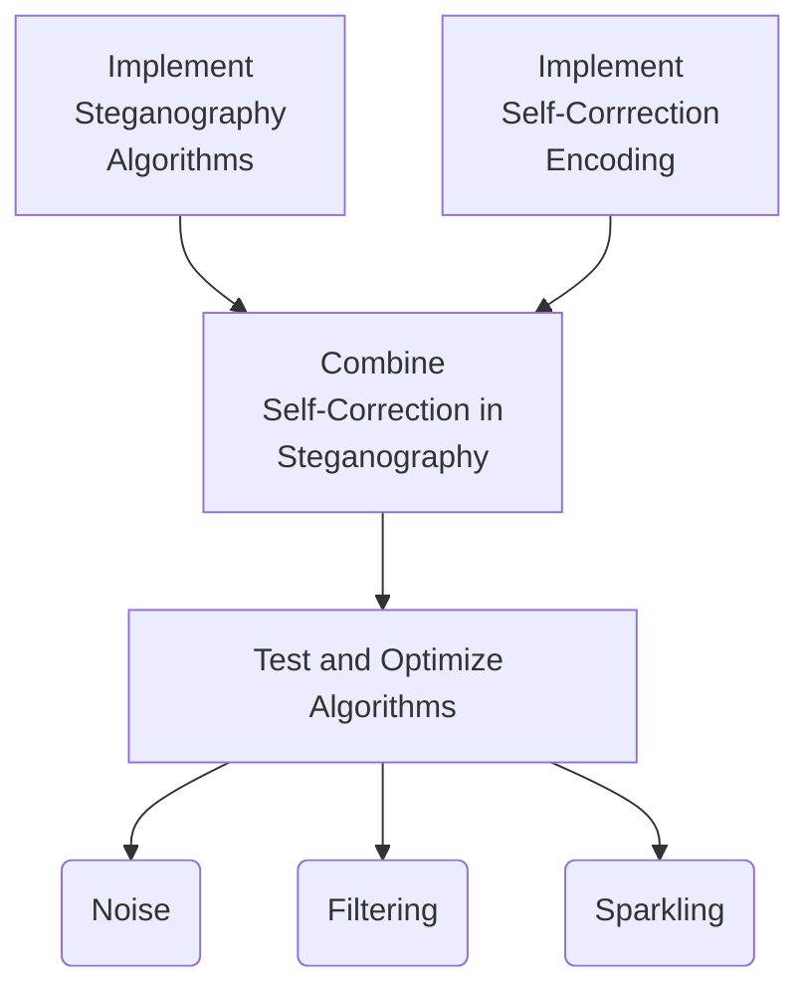

# Self-Corrrection in Image Steganography Proposal

This poposal is for the project *Self-Corrrection in Image Steganography* in Digital Image Processing course, the complete resources can be retrieved at [our GitHub repo]().

Our group has two memebers:

- HUANG Guanchao, SID 11912309, from SME
- LI Wenjie, SID xxxxxxxx, from SME

[toc]

---

## Basics About Our Project

### Steganography

### Self-Correction

---

## Applications of Our Work

---

## Objectives and Roadmap

---

## Key and Difficult Points

---

## Schedule
