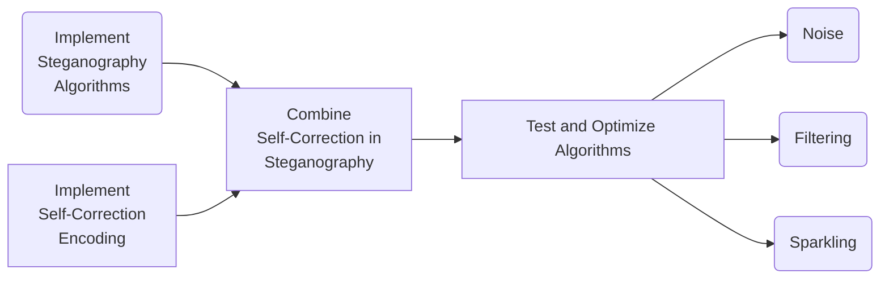

# Self-Correction in Image Steganography Proposal

This proposal is for the project *Self-Correction in Image Steganography* in Digital Image Processing course, the complete resources can be retrieved at [our GitHub repo](https://github.com/kommunium/dip-project-stegano).

Our group has two members:

- HUANG Guanchao, SID 11912309, from SME
- LI Wenjie, SID 11912721, from SME

[toc]

---

## Basics About Our Project

In this proposal, we will first explain the two core concepts in the project.

### Steganography

>*Steganography* is the practice of concealing a message within another message or a physical object. In computing/electronic contexts, a computer file, message, image, or video is concealed within another file, message, image, or video.
>
>The advantage of steganography over cryptography alone is that the intended secret message does not attract attention to itself as an object of scrutiny. Plainly visible encrypted messages, no matter how unbreakable they are, arouse interest and may in themselves be incriminating in countries in which encryption is illegal.[^stegano]

[^stegano]: [Wikipedia: Steganography](https://en.wikipedia.org/wiki/Steganography)

And specifically, in the case of digital image steganography, it can be encrypt or hide an image in another image, or any other forms of digital information, such as a text string, into an image.

The following presents a few of the digital image steganography approaches.

#### Encoding Information in Metadata

Generally, for most of the digital images formats, an image would hold metadata that stores the device of taking this picture, ISO value, geography position, etc. We may rewrite such metadata with information intended to hide.

#### LSB Algorithm

One common example for such encryption is *LSB algorithm*.

>In digital steganography, sensitive messages may be concealed by manipulating and storing information in the *least significant bits* of an image or a sound file. The user may later recover this information by extracting the least significant bits of the manipulated pixels to recover the original message. This allows the storage or transfer of digital information to remain concealed.[^LSB]

Since human eyes can hardly distinguish the difference in the change of the least significant bits, LSB algorithm is highly elusive, and the file size after encrypting remains unchanged.

[^LSB]: [Wikipedia: Least Significant Bit](https://en.wikipedia.org/wiki/Bit_numbering#Least_significant_bit)

### Self-Correction

*Self-correction*, or particularly self-correction code is widely used in computer technology. In data transfer and storage, data is possible to be corrupted with either bit-flip or other physical forms of damage, such as dimmed or covered. Some specific ways of encoding an decoding data allows us to discover and even correct such data error, with a small cost of space and performance.

#### Hamming Code

>In computer science and telecommunication, *Hamming codes* are a family of linear error-correcting codes. Hamming codes can detect up to two-bit errors or correct one-bit errors without detection of uncorrected errors. By contrast, the simple parity code cannot correct errors, and can detect only an odd number of bits in error. Hamming codes are perfect codes, that is, they achieve the highest possible rate for codes with their block length and minimum distance of three. Richard W. Hamming invented Hamming codes in 1950 as a way of automatically correcting errors introduced by punched card readers. In his original paper, Hamming elaborated his general idea, but specifically focused on the Hamming (7, 4) code which adds three parity bits to four bits of data.[^hamming]

[^hamming]: [Wikipedia: Hamming Code](https://en.wikipedia.org/wiki/Hamming_code)

#### Reed-Solomon Code

>*Reed–Solomon codes* are a group of error-correcting codes that were introduced by Irving S. Reed and Gustave Solomon in 1960. They have many applications, the most prominent of which include consumer technologies such as Minidiscs, CDs, DVDs, Blu-ray discs, QR codes, data transmission technologies such as DSL and WiMAX, broadcast systems such as satellite communications, DVB and ATSC, and storage systems such as RAID 6.[^RS]

[^RS]: [Wikipedia: Reed–Solomon error correction](https://en.wikipedia.org/wiki/Reed%E2%80%93Solomon_error_correction)

---

## Applications of Our Work

### Steganography

The existing communication security is mainly divided into encryption and information hiding: encryption mainly operates on the secret information itself, but the plaintext after special processing is more likely to be suspected by the third party; Information hiding hides the existence of the secret data, which makes the secret data communicate covertly without the suspicion of the third party. In recent years, steganography has become the focus of information security. Because every web site relies on multimedia, such as audio, video, and images. Steganography can embed secret information into digital media without damaging the quality of its carrier. The third party is neither aware of the existence of secret information nor aware of the existence of secret information. Therefore, key, digital signature and private information can be transmitted safely in an open environment (such as Internet or intranet).

### Self-Correction

Taking Hamming code as an example, Hamming code inserts verification code into the message stream of transmission. When the computer stores or moves data, it may produce data bit error to detect and correct single bit error. Due to the advantage of Hamming code, this technology is widely used in memory (RAM), in order to ensure that there is no error in the process of information storage and transmission.

---

## Objectives and Road-map

In one word, our project is intended to implement an steganography algorithm, that combines self-correction function in which. Such an algorithm should be capable to decode the correct message encoded in the digital image with corrupted data in certain conditions, such as with noise, filtered, or sparkled



---

## Key and Difficult Points

Our project has the following key and difficult points.

- How to implement these algorithms in `Python`? High code skills are necessary in such a complex development.
- How to combine the steganography and self-correction algorithms? Such an idea is brand new and needs a lpt of exploration.
- How can we ensure that our combined steganography algorithm is capable for self-correction, and maintains robustness in complicated conditions?
- etc.

Most of them needs experimental result for finding solutions, we will keep focusing on dealing with these technical obstacles.

---

## Schedule

```mermaid
gantt
    title Project Schedule
    dateFormat MM-DD

    section Basic<br>Knowledge
    Presentation preparation        :crit, done, a1, 04-24, 04-25
    Proposal                        :crit, active, a2, after a1, 05-03
    Steganography algorithms        :active, a3, after a1, 10d
    Self-Correction algorithms      :active, a3, after a1, 10d

    section Code<br>Implementation
    Metadata Steganography          :b1, 05-03, 1d
    LSB Steganography               :b2, after b1, 2d
    Traditional Steganography Test  :b6, after b2, 3d
    Hamming Code                    :b3, 05-03 a3, 3d
    Reed-Solomon Code               :b4, after b3, 3d
    Combining Algorithms            :b5, after b4, 3d

    section Combination<br>Test
    Noise test                      :c1, after b5, 1d
    Covering test                   :c2, after b5, 1d
    Filtering test                  :c3, after c1, 1d

    section Finale
    Composing report                :crit, d1, after c3, 5d
```